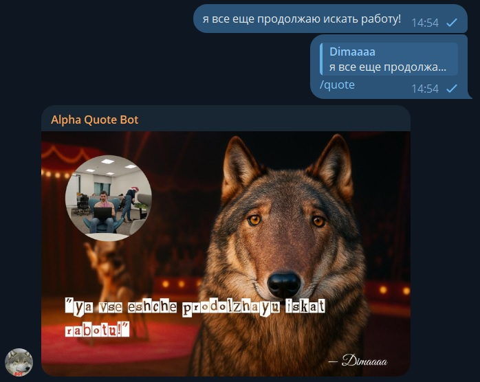

# Alpha Quote Bot

> Telegram-бот, который превращает сообщения в **цитаты** с фоном и пользовательским аватаром.  
> Поддерживает генерацию **изображений** и **GIF-анимаций** с красивым оформлением.



---

## Возможности

- Генерация цитаты-картинки по команде `/quote`
- Анимация появления текста `/quote_gif`
- Поддержка эмодзи в тексте цитаты
- `/quote_gif_file` — гифка отправляется как файл (без Telegram-сжатия)
- Случайный фон из набора (`assets/quote1.jpg` … `quote5.jpg`)
- Аватар пользователя вставляется в круг слева, при отсутствии — генерируется заглушка
- Шрифты: цитата — `Pauls Ransom Note`, автор — `Great Vibes`

---

## Требования

- **Node.js** 18 или выше (рекомендуется 20 LTS)
- Telegram Bot Token от [@BotFather](https://t.me/BotFather)

---

## Установка

```bash
# 1. Клонировать репозиторий
git clone https://github.com/Lcorinna/alpha_quote_bot.git
cd alpha_quote_bot

# 2. Установить зависимости
# Флаг --ignore-scripts нужен из-за устаревшей внутренней зависимости gifencoder
npm install --ignore-scripts

# 3. Создать файл .env в корне проекта
```

Содержимое `.env`:
```
BOT_TOKEN=ваш_токен_от_BotFather
```

---

## Запуск

```bash
node index.js
```

---

## Команды бота

| Команда             | Где работает | Описание                                        |
|---------------------|--------------|-------------------------------------------------|
| `/start`            | личка        | Приветствие и краткая инструкция                |
| `/about`            | личка        | Информация об авторе                            |
| `/quote`            | группа       | Ответь на сообщение — получишь картинку-цитату  |
| `/quote_gif`        | группа       | То же, но в виде GIF-анимации                   |
| `/quote_gif_file`   | группа       | GIF отправляется как файл (без пересжатия)      |

> `/quote` и `/quote_gif` работают только в **ответ на чужое сообщение** в группе.

---

## Структура проекта

```
index.js              — точка входа, регистрация команд
commands/             — обработчики команд бота
helpers/              — утилиты (аватар, шрифты, очередь, статистика)
render/               — генерация изображения и GIF
assets/               — фоны, шрифты, временные файлы
```

---

## Автор

**Gaydaychuk Dmitry**  
[Telegram](https://t.me/Gaydaychuk) · [Email](mailto:Gaida95@yandex.ru)
